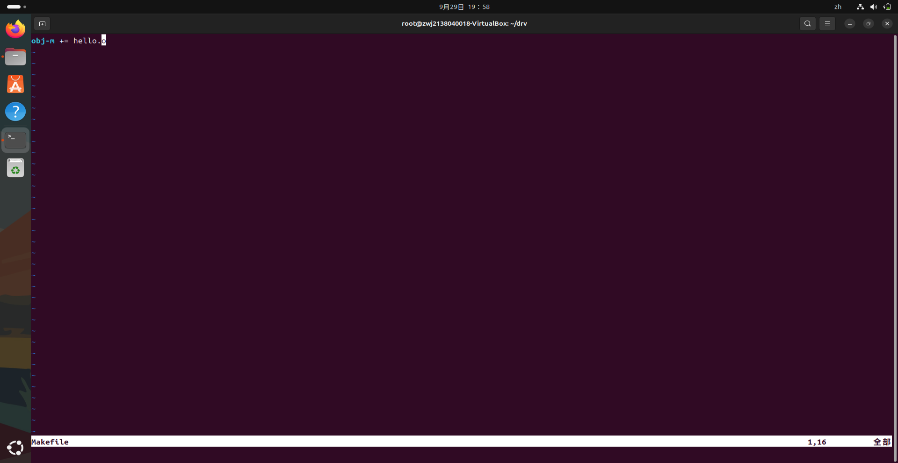
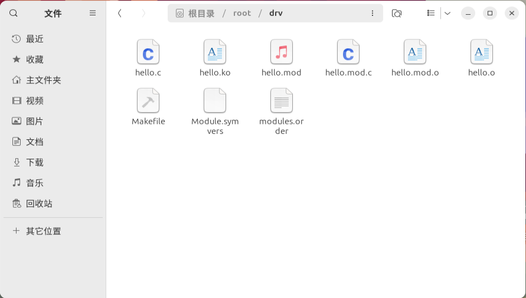
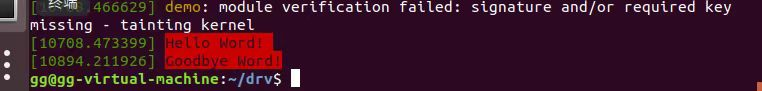

# Linux 驱动程序设计实验指导书

**Warning:各位亲爱的CSGO：Global Offensive2 的玩家朋友，我们的虚拟机无法和完美世界电竞平台同时出现在您的电脑上，为了学习嵌入式，请删除完美世界电竞平台。**
*另：经验证，5E平台不受影响。*

## 1. 实验目的
- 掌握Linux设备驱动程序的编写与测试。
- 了解驱动程序的加载、卸载及其与内核的交互过程。
- 学会在Linux系统中使用`insmod`、`rmmod`、`lsmod`、`dmesg`等命令管理驱动程序。

## 2. 实验准备
### 2.1 实验设备
- **硬件**：个人电脑
- **软件**：Linux操作系统（如Ubuntu），以及安装了基本的开发工具（如`gcc`、`make`等）。

### 2.2 环境配置
- 确保已经正确安装Linux操作系统，并可以使用命令行工具。
- 使用VirtualBox或其他虚拟机软件以便隔离实验环境。

## 3. 实验步骤

### 3.1 创建驱动程序源码文件
1. 在终端中进入实验目录，创建一个名为`drv`的文件夹以存放所有驱动程序相关文件：
   ```bash
   mkdir drv
   cd drv
   ```

2. 使用以下命令创建一个名为`hello.c`的C语言源代码文件：
   ```bash
   gedit hello.c
   ```
   - 在这一步中，你也可以使用Vim来完成操作。在确保你的路径为drv的前提下，使用`Vim hello.c`来完成内容创建。

3. 在文件中添加以下代码，创建一个简单的驱动程序：
   ```c
   #include<linux/init.h>
   #include <linux/module.h>
   #include <linux/kernel.h>

   static int__init hello_init(void)
   {
       printk(KERN_ALERT "Hello, World!\n");
       return 0;
   }

   static void__exit hello_exit(void) {
       printk(KERN_INFO "Goodbye, World!\n");
   }

   MODULE_LICENSE("GPL");
   MODULE_DESCRIPTION("A simple hello world module");
   MODULE_AUTHOR("Your Name");
   module_init(hello_init);
   module_init(hello_exit);
   ```

4. 保存并关闭`hello.c`文件。

【图片1：显示`hello.c`文件的内容】

### 3.2 编写Makefile
1. 在相同目录下创建一个名为`Makefile`的文件，输入以下内容：
   ```makefile
   obj-m += hello.o
   ```



2. 保存并关闭`Makefile`文件。


### 3.3 编译驱动程序
1. 在终端中运行`make`命令来编译驱动程序：
   ```bash
   make -C /lib/modules/$(uname -r)/build M=$(pwd) modules
   ```

2. 确认编译成功后，会生成一个名为`hello.ko`的驱动模块文件。可以用`ls`查看当前目录下生成的目标程序。




### 3.4 加载驱动程序模块
1. 使用`insmod`命令加载该模块：
   ```bash
   sudo insmod hello.ko
   ```

2. 使用`lsmod`命令检查驱动模块是否成功加载：
   ```bash
   lsmod hello.ko
   ```
   ```bash
    lsmod
   ```
   可以看到输出结果
   


3. 使用`dmesg`命令查看系统日志，确认驱动模块是否输出“Hello, World!”信息：
   ```bash
   dmesg | tail
   ```


### 3.5 卸载驱动程序模块
1. 使用`rmmod`命令卸载驱动程序：
   ```bash
   sudo rmmod hello
   ```

2. 使用`dmesg`再次查看日志，确认已输出“Goodbye, World!”信息：
   ```bash
   dmesg | tail
   ```
   



## 掌握Linux驱动程序设计的调试过程

### 1. 编写驱动程序

1. 从虚拟机运行Linux操作系统，启动终端后新建一个目录`chrdrv`。

    ```bash
    mkdir chrdrv
    cd chrdrv
    ```

2. 使用gedit编写一个字符设备驱动框架取名为`demo.c`。

    ```bash
    gedit demo.c
    ```

    demo.c文件内容
   ```bash
   /******* demo.c******/

#define demo_MAJOR 267
#define demo_MINOR 0
static int MAX_BUF_LEN = 1024;
static char drv_buf[1024];
static int WRI_LENGTH = 0;

static ssize_t demo_write(struct file *, const char *, size_t);
static ssize_t demo_read(struct file *, char *, size_t, loff_t *);
static void do_write(void);

static struct file_operations demo_fops = {
    owner: THIS_MODULE,
    open: demo_open,
    read: demo_read,
    write: demo_write,
    llseek: demo_llseek(),
    ioctl: demo_ioctl,
    release: demo_release,
};

/************头文件*****/
#include <linux/mm.h>
#include <linux/module.h>
#include <asm/segment.h>
#include <asm/uaccess.h>
#include <linux/init.h>
#include <linux/kernel.h>
#include <linux/slab.h>
#include <linux/fs.h>
#include <linux/errno.h>
#include <linux/types.h>
#include <linux/proc_fs.h>
#include <linux/fcntl.h>
#include <asm/system.h>

/* COPY TO USER */
/* printk() */
/* kmalloc() */
/* everything... */
/* error codes */
/* size_t */
/* 0_ACCMODE */
/* cli(), *_flags */

/***********定义常量、变量、函数******/

/******* demo_read()函数******/
static ssize_t demo_read(struct file *filp, char *buffer, size_t count, loff_t *f_pos) {
    if (count > MAX_BUF_LEN)
        count = MAX_BUF_LEN;
    // copy_to_user(buffer, drv_buf, count);
    printk("user read data from driver\n");
    return count;
}

/******* demo_write()函数******/
static ssize_t demo_write(struct file *filp, const char *buffer, size_t count) {
    if (count > MAX_BUF_LEN)
        count = MAX_BUF_LEN;
    // copy_from_user(drv_buf, buffer, count);
    WRI_LENGTH = count;
    printk("user write data to driver\n");
    do_write();
    return count;
}

/******* do_write()函数:将缓冲区中的数逆序******/
static void do_write() {
    int i;
    int len = WRI_LENGTH;
    char tmp;
    for (i = 0; i < (len >> 1); i++, len--)
        tmp = drv_buf[len - 1], drv_buf[len - 1] = drv_buf[i], drv_buf[i] = tmp;
}

/******* demo_init()函数******/
static int __init demo_init(void) {
    int result;
    result = register_chrdev(demo_MAJOR, "demodrv", &demo_fops);
    if (result < 0)
        printk("DEVICE_NAME initialized failure\n");
    else
        printk("DEVICE_NAME initialized\n");
    return result;
}

/******* demo_exit()函数******/
static void __exit demo_exit(void) {
    // unregister_chrdev(demo_MAJOR, "demodrv");
    // kfree(demo_devices);
    printk("DEVICE_NAME unloaded\n");
}

/*******系统调用模块接口******/
module_init(demo_init);
module_exit(demo_exit);
```

4. 编写完毕后保存文件，按照此方式分别编写一个测试驱动的程序取名为`test_demo.c`，一个`Makefile`文件。

5. 使用`ls`命令查看目录中的文件。

    ```bash
    ls
    ```

    应看到如下文件：`demo.c`、`Makefile`、`test_demo.c`。

### 2. 编译驱动程序

1. 使用Make编译驱动和测试文件，可以看到生成了`demodrv.ko`驱动模块。

    ```bash
    make
    ```

2. 编译完成后，使用`ls`命令查看生成的文件。

    ```bash
    ls
    ```

    应看到如下文件：`demo.c`、`demodrv.mod.o`、`Makefile`、`Module.symvers`、`test_demo.o`、`demodrv.ko`、`demodrv.o`、`Module.markers`、`test_demo`、`modules.order`、`test_demo.c`。

### 3. 创建设备节点

1. 使用`mknod`命令创建设备节点。

    ```bash
    mknod /dev/demodrv c 267 0
    ```

2. 使用`ll`命令查看该节点的详细信息。

    ```bash
    ll /dev/demodrv
    ```

### 4. 插入驱动模块

1. 使用`insmod`命令插入驱动模块。

    ```bash
    insmod demodrv.ko
    ```

2. 使用`lsmod`命令查看模块是否加载成功。

    ```bash
    lsmod
    ```

3. 查看`/proc/modules`文件中有关该模块加载的信息。

    ```bash
    cat /proc/modules
    ```

4. 查看`/var/log/messages`中关于该模块加载、读/写的输出信息。

    ```bash
    cat /var/log/messages
    ```

### 5. 测试驱动程序

1. 运行测试程序`test_demo`。

    ```bash
    ./test_demo
    ```

2. 观察应用程序访问驱动的情形。

### 6. 卸载驱动模块

1. 使用`rmmod`命令将驱动模块卸载。

    ```bash
    rmmod demodrv.ko
    ```

2. 再次运行测试程序，验证驱动程序是否被卸载。

    ```bash
    ./test_demo
    ```

## 实验思考题

1. **驱动程序和应用程序有何区别？**

    驱动程序是操作系统的一部分，用于控制硬件设备；应用程序则是用户与操作系统之间的接口，用于执行特定任务。

2. **使用哪些命令能够实现Linux驱动模块的动态加载和卸载？**

    - 加载驱动模块：`insmod`
    - 卸载驱动模块：`rmmod`
    - 查看加载的模块：`lsmod`
    - 查看模块信息：`cat /proc/modules`

## 实验总结

通过本次实验，你应该能够理解Linux驱动程序的基本框架，并掌握驱动程序的编写、编译、加载、卸载和调试过程。

### 3.8 可能需要用到的补充内容
- Vim相关知识：Vim在使用的过程从，按`I`进入编辑模式，即可以书写代码。按`ESC`可推出编辑模式，按`:`，进入命令模式，同时，在命令模式中按`wq`，即可保存退出Vim。
- 你可能用到的终端指令：`cd /xx/xx/xx`，帮助你切换到xx（你指定的）路径，因为在实验中，要求你在同一路径下，cd可以帮助你快速切换。sudo+指令，让这条指令获得高级权限。
- 如何开启root权限。`sudo passwd root`,而后设置密码即可。下次想要开启root，只需要输入`sudo su`,而后输入刚刚设置的密码 即可开启。
【图片8：显示设备节点读取的输出结果】

## 4. 实验结果展示
在实验中，通过以下步骤可以观察到系统日志的输出：
1. 加载驱动程序时，`dmesg`输出“Hello, World!”。
2. 卸载驱动程序时，`dmesg`输出“Goodbye, World!”。

【图片9：显示完整的日志输出，包括“Hello, World!”和“Goodbye, World!”的日志信息】

## 5. 常见问题分析与解决

### 5.1 编译错误
- **问题**：在运行`make`时可能出现错误，提示找不到内核头文件。
- **解决方案**：确保已经安装了Linux内核头文件。可以通过以下命令安装：
  ```bash
  sudo apt-get install linux-headers-$(uname -r)
  ```

### 5.2 无法加载驱动程序
- **问题**：使用`insmod`命令时，提示权限不足或模块加载失败。
- **解决方案**：确保使用`sudo`运行命令，并检查模块的编译是否成功。

### 5.3 驱动程序加载后没有输出日志
- **问题**：使用`dmesg`命令没有看到预期的“Hello, World!”或“Goodbye, World!”信息。
- **解决方案**：可能是日志缓冲区已满。使用`dmesg -c`清空缓冲区后，再次加载驱动进行测试。

### 5.4 无法卸载驱动模块
- **问题**：`rmmod`命令无法卸载模块，提示模块正在使用中。
- **解决方案**：确保没有进程正在使用该模块。可以使用以下命令查看模块的使用情况：
  ```bash
  lsmod | grep hello
  ```

### 5.5 输入课本中命令报错
- **问题**：提醒：目前无此命令，需要输入`sudo apt-get install xxx`
- **解决方案**：按照指定命令输入即可，有些东西Linux并没有直接都给你安装好。

## 6. 结果分析
通过本次实验，成功编写并加载了一个简单的Linux驱动模块，理解了驱动程序的基本工作流程。实验达到了以下目的：
- 学习了如何编写简单的驱动程序。
- 学会了如何使用Linux命令管理驱动模块。
- 掌握了驱动程序与系统日志的交互方法。

## 7. 思考题
- 什么是驱动程序？它的作用是什么？
- 你觉得这个简单的驱动程序可以扩展来做什么样的工作？
- 如何让驱动程序能够和应用程序进行交互？
